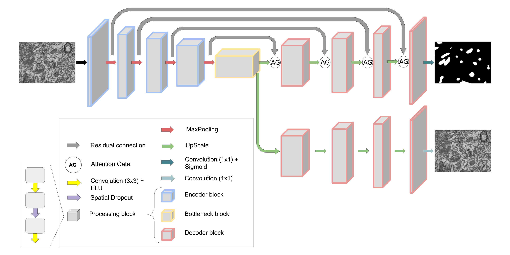

# Attention Y-Net
 
Domain adaptation can be considered a transfer learning problem, so in our paper we decide to study Y-Net [1] like architecture, but using Attention U-Net [2] as a base architecture.
 

</img>
 
You can train and use the model with your data following these steps:
 
- Create a Python3 environment:
 
```Bash
python3 -m venv tutorial-env
```
 
- Activate it:
 
```Bash
source tutorial-env/bin/activate
```
 
- Install the python libraries provided in the `requirements.txt` file:
 
```Bash
python3 -m pip install -r requirements.txt
```
 
- Clone the repo
 
```Bash
git clone https://github.com/danifranco/EM_domain_adaptation.git EM_domain_adaptation
cd EM_domain_adaptation/Attention_Y-Net
```
 
- Prepare the data.
 
    - Each data directory must be organized as follows:
 
        ```
        data/
            |-- train/
            |    |-- x/
            |    |      training-0001.tif
            |    |      ...
            |    |-- y/
            |    |      training_groundtruth-0001.tif
            |    |        ...
            |-- test/
            |    |-- x/
            |    |      testing-0001.tif
            |    |      ...
            |    |-- y/
            |    |      testing_groundtruth-0001.tif
            |    |      ...
 
        ```
        Image and labels will be matched by the filename order, so it is important to keep the same order.
 
    - You will need two directories:
        * `trainA`: to store the target dataset. Target dataset does not need `y/` folder with the labels. You only need `test/y` in the `test` section if you want to evaluate the model.
        * `trainB`: to store the source dataset.
   
- Train and evaluate the network:
 
    * **Step by step**: Using the `Att_YNet_Notebook.ipynb`.
       
        You only need to change variable values in the `Parameters` section and run all:
           
        1) Specify the path of your data in the `data_path` variable.
        2) Specify from `data_path` the directory name with the `source` dataset and the directory name with `target` dataset.
        3) Change as you want the values of the rest of the parameters. Depending on the Training step you should use different ones, as for example the `alpha` value. By default, the last training step parameters are set.
        4) Run all.
 
    * **All at once**: Using the `Att_YNet.py`.
       
        You only need to change variable values in the `Parameters` section and run all:
           
        1) Specify the path of your data in the `dataset_path` variable.
        2) Specify in one list, in the `datasets` variable, the datasets (directory names) you want to use from `dataset_path`. 
        
            **Note:** from this list all possible combinations will be trained the 3 steps and tested all of them.

        3) Change as you want the values of the rest of the parameters. Those variables, with a list of 3 values, contain in order the value that will be used in each training step.
        4) Run all.
            ```Bash
            python3 Att_YNet.py
            ```
        This will generate, a `.json` file with all the results, where `matrix per repetition` contains the IOU value obtained in the test set of the target dataset, in the last training step of each repetition. `mean matrix` Contains the mean values among all the repetitions, and `std matrix` the standard deviation. Also, a `errors.log` will be generated with all the errors produced during the execution.
       
        Finally, the weights of each model will be stored. The names of the weights indicate some information about the model: the training step (weights0, for the first step, weights1 for the second, ...), the repetition (r-0, r-1, ...), folder used as a source dataset (src-Kasthuri++, ...), folder used as a target dataset (trg-VNC, ...) and some training parameters.
 
 
## References
 
```
[1] Joris Roels, Julian Hennies, Yvan Saeys, Wilfried Philips, & Anna Kreshuk. (2018). Domain Adaptive Segmentation in Volume Electron Microscopy Imaging.
 
[2] Ozan Oktay, Jo Schlemper, Loic Le Folgoc, Matthew Lee, Mattias Heinrich, Kazunari Misawa, Kensaku Mori, Steven McDonagh, Nils Y Hammerla, Bernhard Kainz, Ben Glocker, & Daniel Rueckert. (2018). Attention U-Net: Learning Where to Look for the Pancreas.
```
 
 

