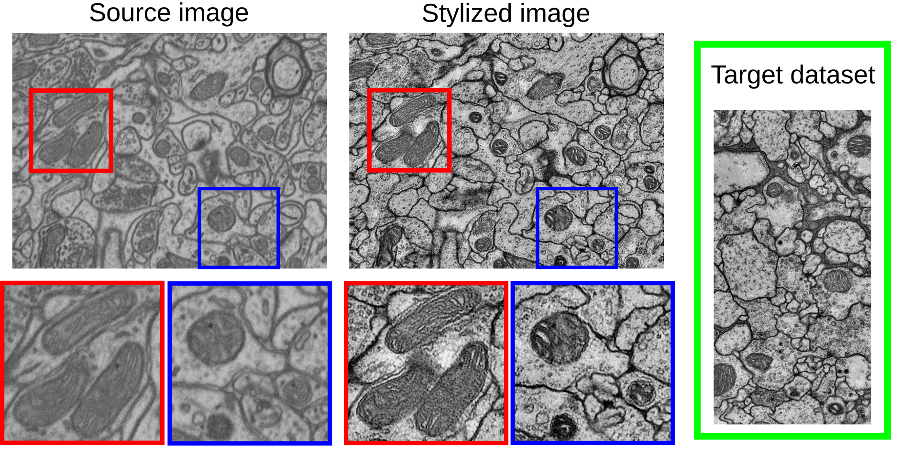

# Style transfer for domain adaptation

Domain adaptation can be considered a style-transfer problem so in our paper we decide to study recently added Contrastive Unpaired Translation (CUT) [1].

<p align="center">                                                                                                      
  </a>       
</p>  

You can reproduce the stylization made following these steps:

- Create a [Conda](https://docs.conda.io/projects/conda/en/latest/index.html) environment with the `.yml` provided here:

```Bash
conda env create -f environment.yml
```

- Activate it:

```Bash
conda activate contrastive-unpaired-translation                                                                         
```

- Clone the repo

```Bash
git clone https://github.com/danifranco/contrastive-unpaired-translation.git CUT
cd CUT
```

- Prepare the data. You will need two directories:

    - `trainA`: to store the target dataset
    - `trainB`: to store the source dataset

- Train the network
```Bash
data_path="/home/user/data" # where trainA and trainB folder are placed
job_name="CUT_test"                                                                                                      
out_dir="/home/user/${jobname}"
checkpoint_dir="${out_dir}/checkpoints"

python train.py --dataroot $data_path --name $job_name --CUT_mode CUT \
                --preprocess crop --crop_size 512 --input_nc 1 \
                --output_nc 1 --checkpoints_dir $checkpoint_dir --display_id 0 
```

- Stylize the images
```Bash
checkpoint_to_restore="latest"

python test.py --dataroot --name $job_name --preprocess none --input_nc 1 \
               --output_nc 1 --epoch $checkpoint_to_restore \                               
               --results_dir ${out_dir}/results --num_test 1000 \                                           
               --CUT_mode CUT --checkpoints_dir $checkpoint_dir --phase train 
```
These last command will create the folder ``/home/user/CUT_test/results/CUT_test/train_*/images/fake_B``
where the stylized images of `trainA` samples are placed. 

## References

```
[1] Park, T., Efros, A. A., Zhang, R., & Zhu, J. Y. (2020, August). Contrastive learning for unpaired
image-to-image translation. In European Conference on Computer Vision (pp. 319-345). Springer, Cham.
```
