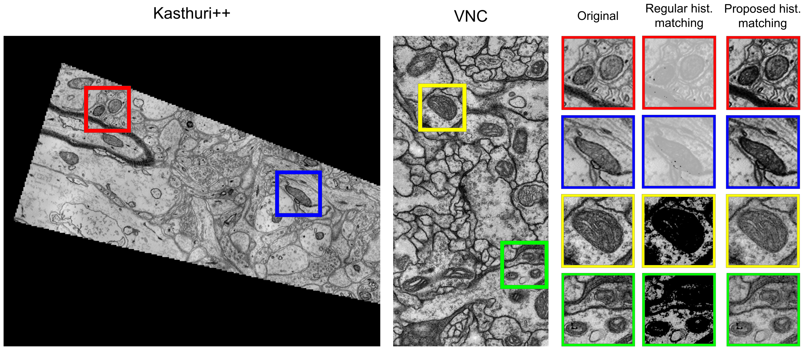

# Histogram matching

Instead of using regular histogram matching between two images, we use as target histogram the mean histogram of the target domain images, so the histogram of all source images are transformed to match it.

In order to solve the padding influence in the histogram, we modified the actual number of zeros with linear regression based on the initial set of values in the histogram. This process is done for both target and source histograms.



## Prepare the data

Each data directory must be organized as follows:

```
data/
    |-- train/
    |    |-- x/
    |    |      training-0001.tif
    |    |      ...
    |    |-- y/
    |    |      training_groundtruth-0001.tif
    |    |        ...
    |-- test/
    |    |-- x/
    |    |      testing-0001.tif
    |    |      ...
    |    |-- y/
    |    |      testing_groundtruth-0001.tif
    |    |      ...
```

## Apply and store histogram matched images

Using the [hist_match](hist_match.ipynb) notebook:

1) Specify directory with all datasets (`data_path`)
2) Which datasets you want to compute (`datasets`)
3) Directory where results are going to be stored (`out_dir`)
4) Run all

This notebook will generate in `out_dir` all `datasets` combination histogram matched images.
Each combination will be identified first by the folders name. First folder indicate which is the Source dataset. Inside this folder, multiple ones can be generated, the name has the following format: "(source)\_s-t\_(target)". Inside those folders, the distribution will be as the original one, including their respective labels (train, test, train/x, train/y, ...).

---
## License
The copyright of the original `_match_cumulative_cdf` function, we used as a base, is in [LICENSE](LICENSE) . 
This function corresponds to the [scikit implementation](https://github.com/scikit-image/scikit-image/blob/e128e0743bb2cded104654352a13ed5b4e53efb8/skimage/exposure/histogram_matching.py#L4) of the histogram matching. 
