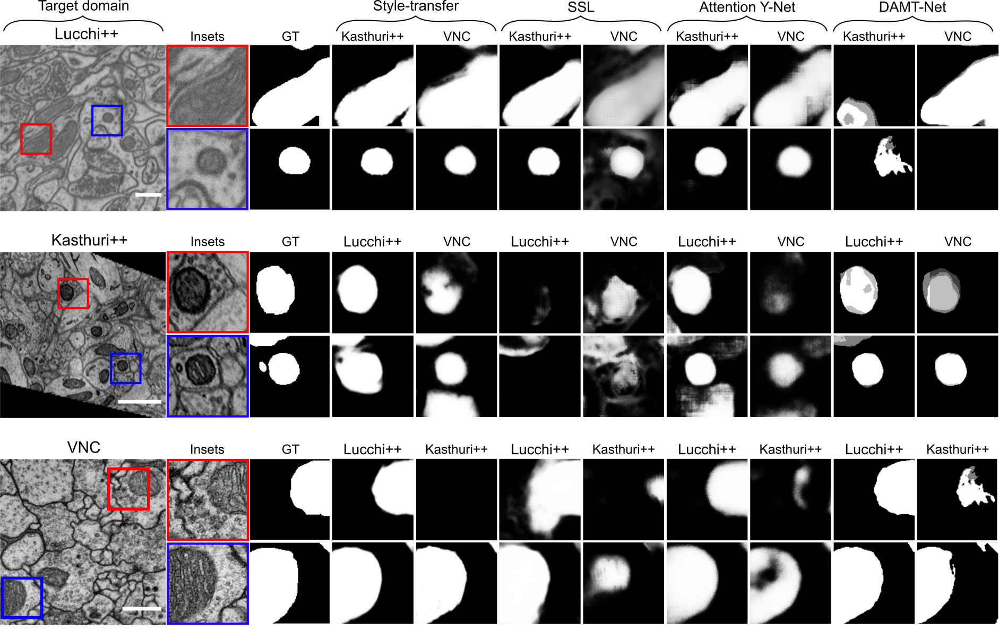

# Deep learning based domain adaptation for mitochondria segmentation on EM volumes
                                                                                                                       
This repository contains the code to reproduce the methods described in the publication entitled "Deep learning based domain adaptation for mitochondria segmentation on EM volumes". 

The code and detailed instructions of the four different implemented strategies are available in the following links:

- [Style-transfer based domain adaptation](CUT).
- [Self-supervised learning (SSL) based domain adpation](SSL).
- [DAMT-Net](DAMT-Net).
- [Attention_Y-Net](Attention_Y-Net).

Qualitative results of all methods are summarized in the next figure:
<p align="center">
  </a>
</p>

## Datasets

The EM datasets used are available here:
- [Lucchi++](https://sites.google.com/view/connectomics/ "Lucchi++")
- [Kasthuri++](https://sites.google.com/view/connectomics/ "Kasthuri++")
- [VNC](https://github.com/unidesigner/groundtruth-drosophila-vnc "VNC")
- [Histogram matched datasets](https://ehubox.ehu.eus/s/X3qRpYsPftxgjPw "Histogram matched datasets")

## Citation                                                                                                             
                                                                                                                        
This repository is the base of the following work:                                                                      
    
```bibtex
@misc{francobarranco2022-dom-adaptation,
    title = {Deep learning based domain adaptation for mitochondria segmentation on EM volumes},
    journal = {Computer Methods and Programs in Biomedicine},
    volume = {222},
    pages = {106949},
    year = {2022},
    issn = {0169-2607},
    doi = {https://doi.org/10.1016/j.cmpb.2022.106949},
    url = {https://www.sciencedirect.com/science/article/pii/S0169260722003315},
    author = {Daniel Franco-Barranco and Julio Pastor-Tronch and Aitor González-Marfil and Arrate Muñoz-Barrutia and Ignacio Arganda-Carreras},
}
```                                                                                                                     
